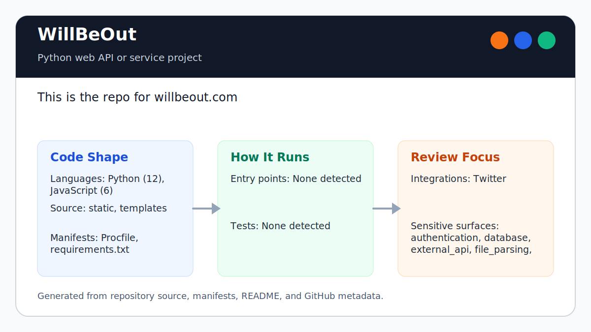

# WillBeOut

<!-- README-OVERVIEW-IMAGE -->


## Overview

`garethpaul/WillBeOut` is a Python web API or service project. This is the repo for willbeout.com

This README is based on the checked-in source, manifests, scripts, and repository metadata on the `master` branch. The project language mix found during review was: Python (24), JavaScript (12), shell (1).

## Repository Contents

- `README`
- `requirements.txt` - Python dependency or packaging metadata
- `.worktrees` - source or example code
- `Procfile`
- `SECURITY.md` - security reporting and disclosure guidance
- `static` - source or example code
- `templates` - source or example code
- `VISION.md` - project direction and maintenance guardrails

Additional scan context:

- Source directories: .worktrees, static, templates
- Dependency and build manifests: Procfile, requirements.txt
- Entry points or build surfaces: none detected
- Test-looking files: no obvious test files detected

## Getting Started

### Prerequisites

- Git
- Python matching the era of the project

### Setup

```bash
git clone https://github.com/garethpaul/WillBeOut.git
cd WillBeOut
python -m pip install -r requirements.txt
```

The setup commands above are derived from repository files. Legacy mobile, Python, or JavaScript samples may require older SDKs or package versions than a modern workstation uses by default.

## Running or Using the Project

- Run `python facebook.py --cookie_secret="$COOKIE_SECRET"` after installing dependencies and configuring Facebook/MySQL options.

## Testing and Verification

- Run `make verify` for static auth/configuration/event-access contracts and
  Python 2 syntax checks.
- Run `make check` for the same gate with bytecode cleanup before and after.
- Completed maintenance plans live under `docs/plans` and are checked by
  `make check`.
- Full runtime verification still requires a Python 2 compatible environment
  for the legacy Tornado and MySQL dependencies.

When the required SDK or runtime is unavailable, use static checks and source review first, then verify on a machine that has the matching platform toolchain.

## Configuration and Secrets

- `COOKIE_SECRET` configures Tornado secure-cookie signing and must not be committed.
- Facebook and MySQL options are read from Tornado command-line/config options; keep credentials out of git.

## Security and Privacy Notes

- Review changes touching authentication or token handling; examples from the scan include .worktrees/fix/issue-1-cookie-secret/attendees.py, .worktrees/fix/issue-1-cookie-secret/auth.py, .worktrees/fix/issue-1-cookie-secret/base.py, .worktrees/fix/issue-1-cookie-secret/cal.py, and 6 more.
- Review changes touching external API calls or credential-adjacent configuration; examples from the scan include .worktrees/fix/issue-1-cookie-secret/auth.py, .worktrees/fix/issue-1-cookie-secret/events.py, .worktrees/fix/issue-1-cookie-secret/static/css/bootstrap-responsive.css, .worktrees/fix/issue-1-cookie-secret/static/css/bootstrap-responsive.min.css, and 6 more.
- Review changes touching network requests, sockets, or service endpoints; examples from the scan include .worktrees/fix/issue-1-cookie-secret/attendees.py, .worktrees/fix/issue-1-cookie-secret/auth.py, .worktrees/fix/issue-1-cookie-secret/base.py, .worktrees/fix/issue-1-cookie-secret/cal.py, and 6 more.
- Review changes touching file, media, JSON, XML, CSV, OCR, or data parsing; examples from the scan include .worktrees/fix/issue-1-cookie-secret/attendees.py, .worktrees/fix/issue-1-cookie-secret/cal.py, .worktrees/fix/issue-1-cookie-secret/events.py, .worktrees/fix/issue-1-cookie-secret/facebook.py, and 6 more.
- Review changes touching database, model, or persistence code; examples from the scan include .worktrees/fix/issue-1-cookie-secret/requirements.txt, requirements.txt.

## Maintenance Notes

- Do not commit generated Python bytecode, local virtual environments, or
  `.env` files.
- See `SECURITY.md` for vulnerability reporting and safe research guidance.
- See `VISION.md` for project direction and contribution guardrails.
- See `docs/plans/2026-06-08-cookie-secret-contract.md` for the current auth
  and cookie-secret baseline.
- See `docs/plans/2026-06-08-safe-auth-next-redirect.md` for the safe
  post-login redirect contract.
- See `docs/plans/2026-06-08-event-access-guard.md` for the event owner/friend
  render guard.

## Contributing

Keep changes small and tied to the project that is already present in this repository. For code changes, document the toolchain used, avoid committing generated dependency directories or local configuration, and update this README when setup or verification steps change.
