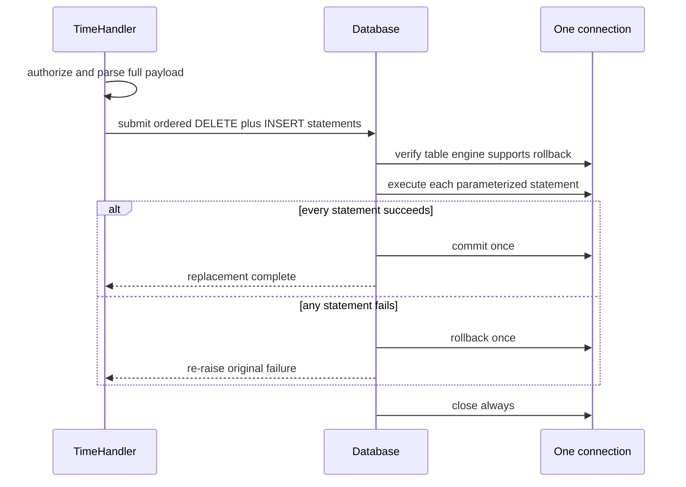

# Make Availability Replacement Atomic

## Summary

Replace an attendee's availability through one database connection and one
commit boundary. The existing payload validation and event authorization stay
unchanged, while a failed DELETE or INSERT rolls the full replacement back.

## Problem Frame

`TimeHandler.post` validates the complete availability payload before writing,
but each call to `Database.execute` opens and commits a separate connection.
If the DELETE succeeds and a later INSERT fails, the request can erase or
partially replace previously valid availability. The database wrapper already
owns connection creation, commit, rollback, and close behavior, making it the
right boundary for an atomic multi-statement operation.

## Requirements

- R1. On the transaction connection, verify that `willbeout_availability` uses
  an approved transactional storage engine before issuing any DELETE.
- R2. Execute the availability DELETE and all ordered INSERT statements on one
  connection and commit exactly once after every statement succeeds.
- R3. Roll back exactly once and re-raise the original exception when any
  statement fails; never commit a partial replacement.
- R4. Fail closed without availability mutation when the table is missing or
  uses a non-transactional or unrecognized storage engine.
- R5. Always close the transaction connection after success or failure.
- R6. Preserve full-payload validation, authenticated event access, accepted
  duplicate values, submitted ordering, successful redirect behavior, and SQL
  parameterization.
- R7. Keep existing single-statement query and execute behavior unchanged.
- R8. Add executable and mutation-sensitive coverage for engine validation,
  transaction ordering,
  commit, rollback, close, handler integration, documentation, and completed
  plan evidence.

## Key Technical Decisions

- KTD1. Put connection lifecycle ownership in `Database`, not the handler.
  This keeps transaction mechanics beside the existing commit/rollback code
  and prevents handlers from reaching into PyMySQL internals.
- KTD2. Validate the target table's engine through `information_schema` on the
  transaction connection. Only an explicit allowlist of rollback-capable
  engines may proceed, and the check occurs before destructive SQL.
- KTD3. Accept an ordered collection of statement/parameter pairs. The caller
  remains responsible for business ordering, while the wrapper guarantees one
  atomic connection boundary.
- KTD4. Preserve the original database exception. The request keeps the
  repository's current failure behavior while gaining rollback safety.
- KTD5. Use dependency-injected fake connections for deterministic coverage.
  A live MySQL smoke test remains an environment-specific follow-up rather than
  a prerequisite for proving connection, commit, rollback, and close semantics.

## High-Level Technical Design

The following flow is directional guidance, not implementation code:

## Implementation Units

### U1. Add an atomic database operation

- **Goal:** Give callers a narrow ordered multi-statement transaction API.
- **Files:** `database.py`, `test_modern_runtime.py`.
- **Test scenarios:** Successful DELETE plus INSERT sequence uses one
  connection, verifies the table engine before writes, preserves parameters
  and ordering, commits once, never rolls back, and closes once. Missing or
  non-transactional engine metadata performs no DELETE or INSERT. A
  middle-statement failure rolls back once, never commits, closes once, stops
  later statements, and re-raises the same error. Existing query and execute
  tests remain green.

### U2. Route availability replacement through the transaction

- **Goal:** Make a valid availability replacement all-or-nothing without
  changing validation or authorization behavior.
- **Files:** `events.py`, `test_modern_runtime.py`.
- **Test scenarios:** Malformed and empty payloads still perform no writes.
  Valid duplicate values produce one ordered transaction containing the DELETE
  followed by INSERTs. A simulated INSERT failure leaves the fake connection
  rolled back with no commit and propagates the failure.

### U3. Enforce and document the boundary

- **Goal:** Prevent regression to independent per-statement commits and keep
  maintenance guidance accurate.
- **Files:** `scripts/check_willbeout_contracts.py`, `README.md`, `SECURITY.md`,
  `VISION.md`, `CHANGES.md`,
  `docs/plans/2026-06-17-availability-replacement-transaction.md`.
- **Test scenarios:** Static contracts reject a missing transaction API,
  handler-side independent writes, commit inside the statement loop, absent
  rollback/close behavior, missing runtime registration, weakened guidance,
  or incomplete plan evidence.

## Scope Boundaries

- Do not change database schema, route shape, form representation,
  event authorization, duplicate-value policy, or redirect behavior.
- Do not add retries, isolation-level changes, connection pooling, migrations,
  or a new dependency.
- Do not claim live MySQL or deployment validation from fake-connection tests.
- Do not merge or close the existing pull-request stack without authorization.

## Risks And Dependencies

- PyMySQL connection implementations must provide the cursor context manager,
  `commit`, `rollback`, and `close` behavior already required by `Database`,
  plus access to the current schema's `information_schema.TABLES` metadata.
- A future live-MySQL smoke test should confirm deployment credentials, table
  engine transaction support, and schema constraints without weakening the
  deterministic no-network gate.

## Acceptance Examples

- AE1. Given availability `2,2,5` on an approved transactional table, when
  every statement succeeds, then one connection commits DELETE plus three
  ordered INSERTs exactly once.
- AE2. Given the same valid payload, when the second INSERT fails, then the
  transaction rolls back, closes, performs no later INSERT, and exposes the
  original database failure.
- AE3. Given `2,invalid`, when the handler validates the request, then it
  returns HTTP 400 before opening a transaction or mutating availability.
- AE4. Given a missing, non-transactional, or unrecognized table engine, when a
  valid replacement is requested, then the operation fails before DELETE and
  closes the connection without committing.

## Work Completed

- Added a database-owned ordered transaction API that validates the target
  table's engine through `information_schema` on the same connection.
- Required verified InnoDB storage before any availability DELETE or INSERT,
  with one commit after success and rollback plus close on every failure.
- Routed valid availability replacement through one transaction while keeping
  complete payload validation and event authorization ahead of database work.
- Added executable connection, handler, engine, rollback, ordering, and
  regression coverage plus a registered static contract and maintained
  guidance.

## Verification Completed

- Six focused database and handler cases passed for successful commit,
  non-transactional and missing tables, middle-statement rollback, malformed
  payload rejection, and ordered replacement.
- The complete modern runtime suite passed 31 tests, including preservation of
  the original statement error when rollback and close cleanup also fail.
- Workflow and dependency-lock suites rejected 21 and 23 mutations,
  respectively.
- Nine isolated transaction mutations were rejected across engine validation,
  metadata ordering, commit, rollback, close, handler integration, runtime
  registration, guidance, and plan completion.
- The canonical `make check` payload is exercised with non-cleaning
  `make verify` under the workspace's explicit-path artifact policy.
- No live MySQL schema, Meta OAuth flow, browser, or deployment was exercised;
  production validation must confirm the availability table remains InnoDB.
